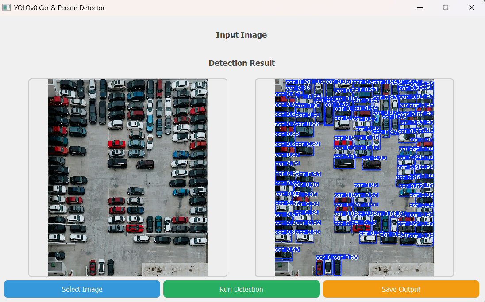
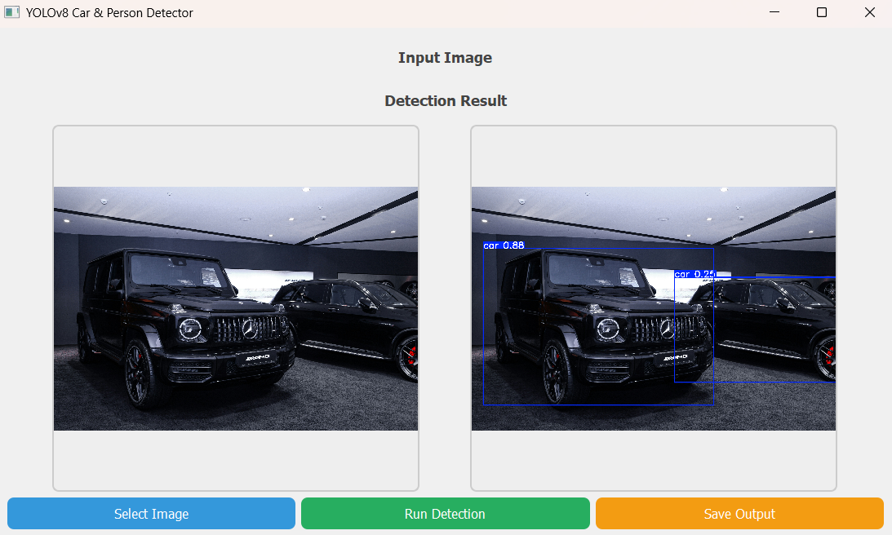
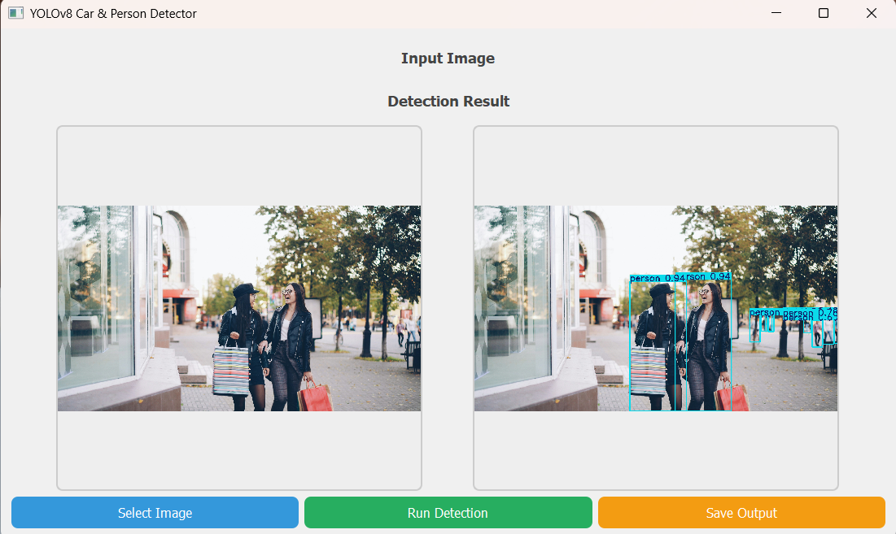
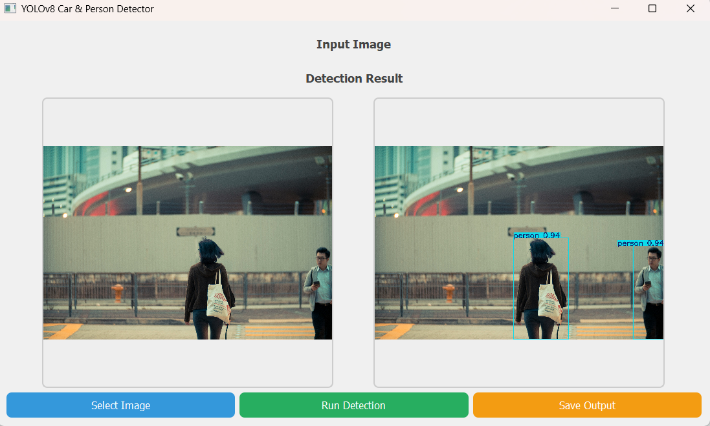
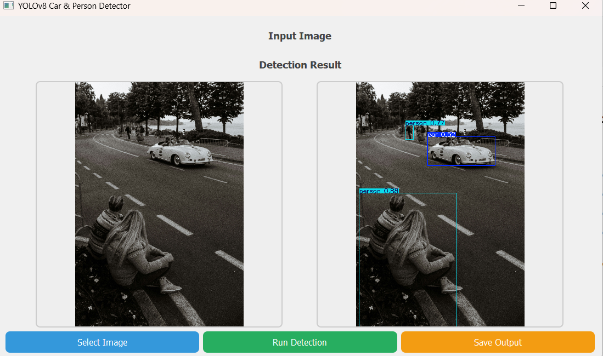

# 🚀 YOLOv8 Car & Person Detection – PyQt5 GUI

Bu proje, YOLOv8 derin öğrenme modeli kullanılarak **Araç (Car)** ve **İnsan (Person)** tespiti yapan gelişmiş bir bilgisayarlı görü uygulamasıdır.  
Model Google Colab üzerinde eğitilmiş ve sonuçlar PyQt5 masaüstü uygulaması ile sunulmuştur.

---

# 📂 Proje Yapısı

| Klasör / Dosya | Açıklama |
|----------------|----------|
| `gui_app.py`   | PyQt5 GUI arayüzü |
| `best.pt`      | Eğitilmiş YOLOv8 model dosyası |
| `predictions/` | Tespit örnek görüntüleri |
| `dataset/`     | Eğitim veri seti |
| `README.md`    | Proje açıklama dosyası |

---

# 🧠 YOLOv8 Model Eğitimi

| Adım | Açıklama |
|------|----------|
| **1️⃣ Gerekli kütüphaneleri yükleyin** | `pip install ultralytics` |
| **2️⃣ Modeli eğitin** | Google Colab üzerinde aşağıdaki kod kullanıldı |

### 📌 Eğitim Kodu

```python
from ultralytics import YOLO

model = YOLO("yolov8s.pt")  # Pretrained model
model.train(
    data="/content/dataset/data.yaml",
    epochs=50,
    imgsz=640,
    batch=8
)
```

📸 Model Sonuçları

Aşağıda modelin eğitim sonrası gerçek görüntüler üzerindeki tespit performansı gösterilmiştir.
Her görselin üstünde kısa açıklama bulunmaktadır.


## 🚗 1. Araç (Car) Tespit Sonuçları  
### ✔ Örnek 1 — Otopark üzerinde yoğun araç tespiti

Bu görselde model, yukarıdan çekilmiş bir otopark görüntüsünde tüm araçları yüksek doğrulukla tespit etmektedir.




### ✔ Örnek 2 — Kapalı alanda araç tespiti

Model, kapalı otopark ortamındaki araçları doğru şekilde algılamaktadır.




---

## 🧍 2. İnsan (Person) Tespit Sonuçları  
### ✔ Örnek 1 — Sokak ortamında insan tespiti

Model, açık alandaki yayaları yüksek doğrulukla tespit etmektedir.




---

## 🚗🧍 3. Karışık Sahne (Araç + İnsan) Tespit Sonuçları  
### ✔ Örnek 1 — Araç ve insanların birlikte bulunduğu sahne

Model, hem araçları hem de insanları doğru şekilde tespit etmektedir.




### ✔ Örnek 2 — Yoğun sahnede çoklu nesne tespiti

Model karmaşık sahnelerde hem araçları hem de insanları aynı anda algılayabilmektedir.




🖥️ PyQt5 Masaüstü Arayüz

Bu GUI uygulaması ile kullanıcı:

📤 Görüntü seçebilir

🤖 YOLOv8 modeli ile tespit çalıştırabilir

🖼️ Önce/Sonra görüntülerini yan yana görüntüleyebilir

💾 Sonucu kaydedebilir

▶️ Uygulamayı Çalıştırma
Adım	Komut
Gerekli kütüphaneler	pip install pyqt5 ultralytics opencv-python
Uygulamayı başlatın	python gui_app.py
Not	best.pt dosyası gui_app.py ile aynı klasörde olmalıdır
👨‍💻 Geliştirici Bilgileri

Ad Soyad: Amir Elahmed
Ders: BLG407 – Makine Öğrenmesi
Öğretim Üyesi: Doç. Dr. Sinan Uğuz

⭐ Proje Durumu

Bu proje tamamen çalışır durumdadır.
YOLOv8 modeli başarıyla eğitilmiş, test edilmiş ve PyQt5 masaüstü GUI’sine entegre edilmiştir.

⭐ Proje Tamamlandı

Bu repo, YOLOv8 nesne tespiti ve PyQt5 GUI entegrasyonu için mükemmel bir örnek niteliğindedir.
Model başarıyla eğitilmiş, test edilmiş ve masaüstü arayüz ile entegre edilmiştir.

